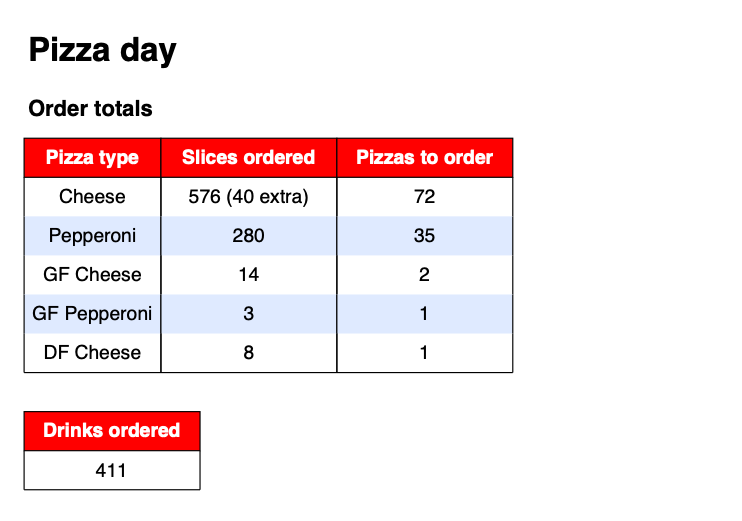

# Pizza day

## Overview

This app takes an exported Excel document from [TDSB's SchoolCash Online](https://tdsb.schoolcashonline.com/) and generates user friendly reports for ordering and distribution of pizza to hungry students on pizza day. It is used by school council members.



[View a sample PDF](https://github.com/redgoose/pizza-day/raw/main/docs/resources/pizza_day.pdf)

If school council had our way we would integrate directly with SchoolCash Online, but we lack access since we are not school staff. Instead, an Excel document is shared with us in this [format](https://github.com/redgoose/pizza-day/raw/main/docs/resources/pizza_day.xlsx).

## Quick start

1. Install [Go](https://golang.org/doc/install)
2. Install `pizza-day`:

	```
	go install github.com/redgoose/pizza-day@latest
	```
3. Rename `pizza-day.sample.yml` to `pizza-day.yml` and modify the configuration to meet your needs. Place this file and the exported Excel file in the same directory as the `pizza-day` executable.
4. Execute `pizza-day` which will then generate a PDF report.

## Testing

Run all tests from the root folder by running:

```
go test -v ./...
```

## License

MIT © redgoose, see [LICENSE](https://github.com/redgoose/pizza-day/blob/main/LICENSE) for details.